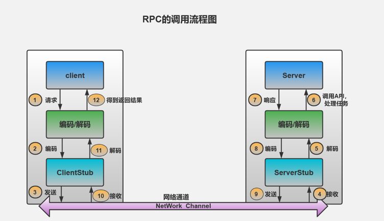
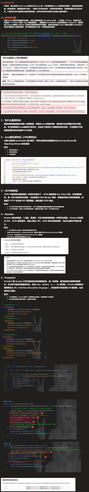
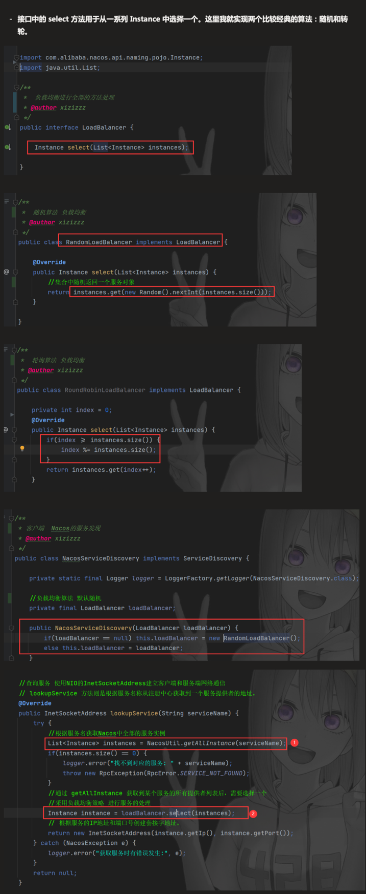
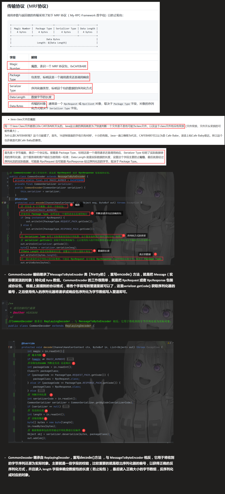
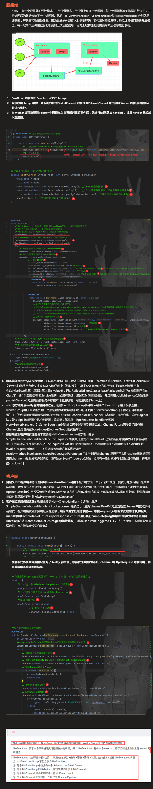
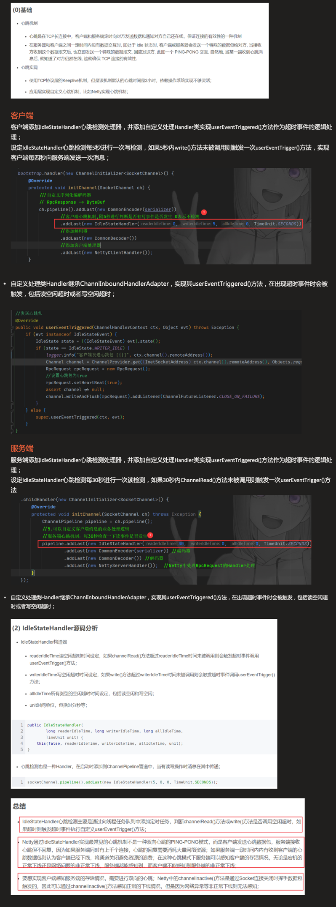
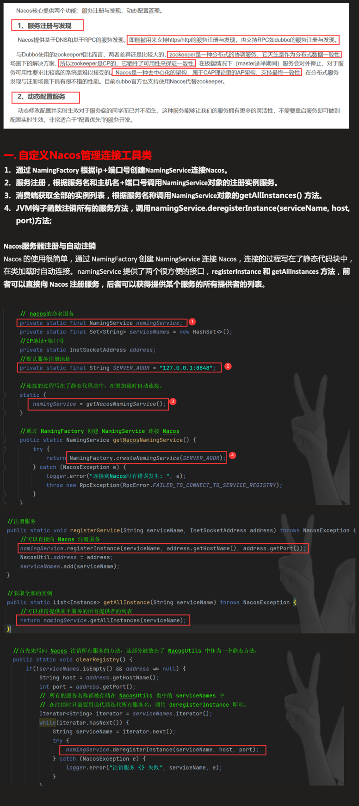
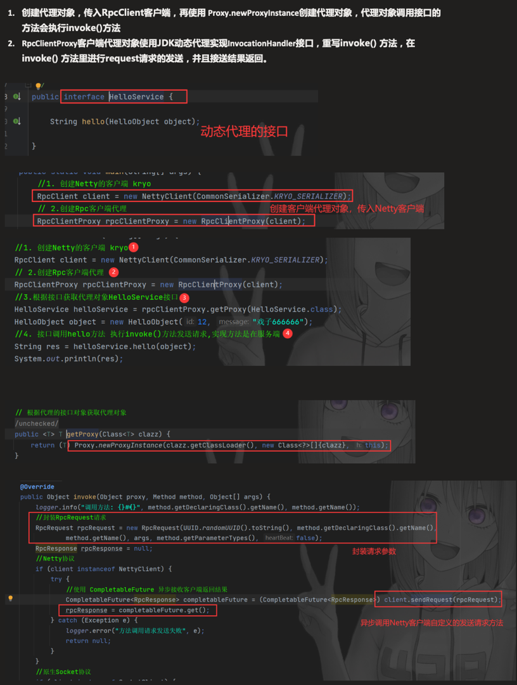
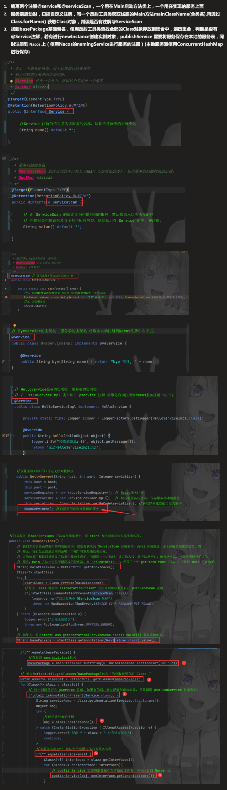

# Hakusai-RPC-Java

<!-- PROJECT SHIELDS -->

<!-- PROJECT LOGO -->
 

    
    <h3 align="center">Java实现的RPC框架</h3>
  

    ·
    <a href="https://github.com/hakusai22/hakusai-RPC-Java/issues">报告Bug</a>
    ·
    <a href="https://github.com/hakusai22/hakusai-RPC-Java/issues">提出新特性</a>
  

## 前言： 

&emsp;&emsp; 该项目是在大四上半实习阶段所做的项目,可能当时不想写业务的项目找了一些偏底层原理的项目进行学习, 
最终在Github上找到的RPC轮子相关项目，对项目进行理解+总结+注释+优化。

## 项目介绍:

## 项目背景：

&emsp;&emsp;RPC框架的目的是可以让客户端用服务端的方法就好像调用本地方法一样简单，服务端向注册中心注册服务，
消费端通过注册中心拿到服务相关信息，然后再通过网络请求调用服务端的服务。

## 项目目标：

&emsp;&emsp;使用Java开发一个RPC框架实现心跳检测，服务注册，远程方法调用，序列化和反序列化。

## 项目技术：Netty+Nacos

### 项目结构:

- rpc-server 服务端处理
- rpc-client 客户端请求
- rpc-core 核心逻辑
- rpc-common 公共请求/响应体
- rpc-api api请求定义

### 项目成果：

1. 实现了四种序列化算法，Json方式、Kryo算法(默认)、Hessian算法与 Protobuf 方式。
    - 
2. 实现了随机与轮转负载均衡算法，并且使用自定义的MRF通信协议以防止粘包问题。
    - 
    - 
3. 消费端和服务端使用Netty网络传输方式，使用Netty的IndleStateHandler实现心跳检测机制。
    - 
    - 
4. 使用Nacos作为注册中心，管理服务注册和发现，并使用JDK动态代理获取RPC客户端接口的代理对象。
    - 
    - 
5. 自定义注解@Service 和 @ServiceScan实现进行服务的自动注册到Nacos和本地注册表中。
    - 

## 总结
